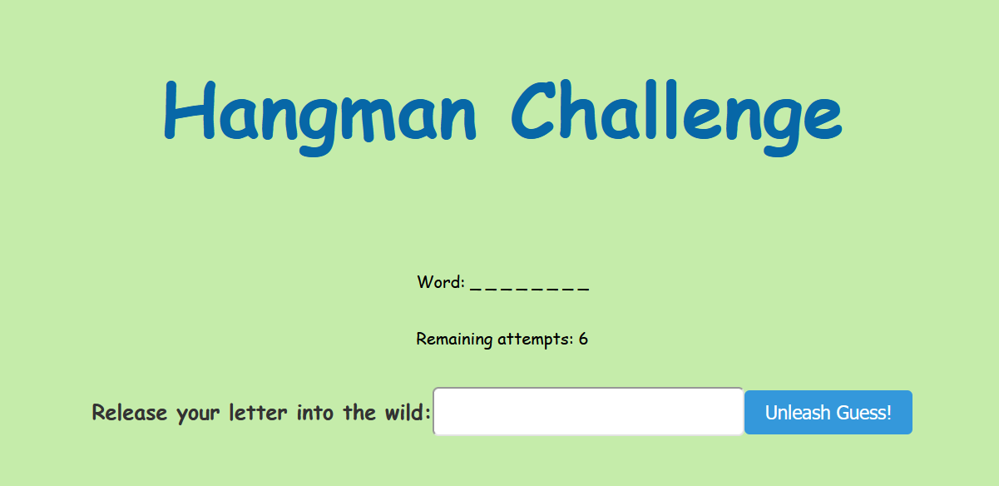
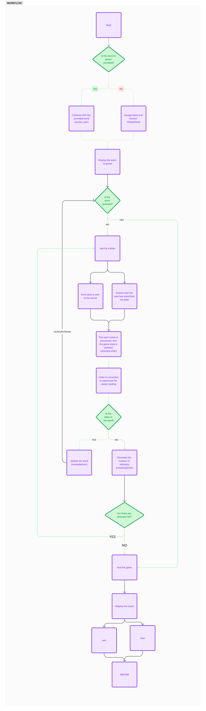

# <h1 align="center">EL JUEGO DEL AHORCADO</h1>

## 🧾 Descripción del Proyecto

este proyecto es el juego del ahorcado (Hangman) utilizando PHP para la lógica del juego y HTML para la interfaz de usuario. El juego termina cuando el jugador adivina la palabra o se agotan los intentos.

## 💻 Tecnologías Utilizadas

- **PHP**: Utilizado para el desarrollo
- **HTML**: Utilizado para la creación de la interfaz de usuario.
- **CSS**: Utilizado para el diseño y estilo de la página.
- **XAMPP**: servidor local para ejecutar el proyecto

## 📚 Workflow

## 🚀 Pasos de Instalación

1. Descarga e instala XAMPP.
2. Clona este repositorio en la carpeta `htdocs` de tu instalación de XAMPP.
3. Inicia los servicios de Apache y MySQL desde el panel de control de XAMPP.
4. Abre tu navegador y ve a `http://localhost/ahorcado`.

## 👩‍💻Autores

 DIANA 💜